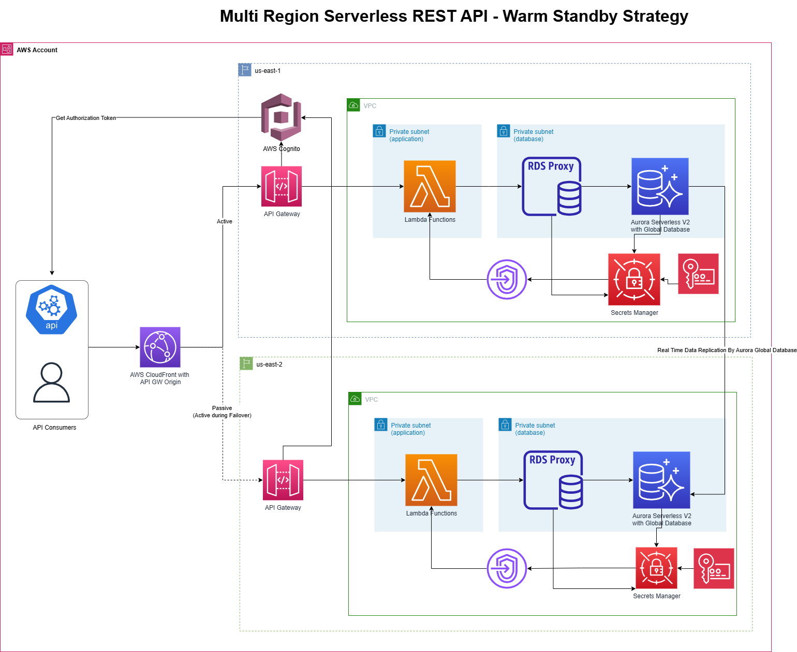

# Multi-Region Serverless Platform for Property Management

## 1. Executive Summary

This repository contains the Infrastructure as Code (IaC) for a production-grade, multi-region serverless platform built on AWS. The platform is designed to power an open-source Property Management API for the Kenyan market, a sector where digital transformation can significantly reduce operational friction for property owners.

The architecture documented here is a blueprint for building modern, cloud-native applications that are **secure, resilient, scalable, and cost-effective by design.**

---

## 2. The Business Problem & The Cloud Solution

**Problem:** Independent property owners in Kenya face significant administrative overhead, relying on manual processes for rent collection, maintenance logging, and financial reconciliation. This leads to payment delays, poor tenant service, and a lack of data for business decisions.

**Solution:** A centralized, reliable, and low-cost API that automates these core workflows. We chose a multi-region, serverless architecture on AWS to directly address the key business requirements:

*   **Extreme Reliability:** The service must be available 24/7, especially during critical end-of-month payment periods.
*   **Low Operational Cost:** The business model requires a low barrier to entry and operating costs that scale linearly with adoption.
*   **Rapid Feature Development:** The ability to quickly introduce new features (e.g., SMS notifications, online payments) is a key competitive advantage.

---

## 3. Architectural Pillars & Business Impact

Our infrastructure stands on four pillars, each delivering a specific, measurable business outcome.

### Pillar 1: High Availability & Disaster Recovery
The system is architected to survive a catastrophic failure of an entire AWS data center region with zero data loss and near-zero downtime.

*   **Technology:** An active-active design across two AWS regions, powered by **Route 53 DNS Failover** and a continuously replicated **Aurora Global Database**.
*   **Business Impact:** Guarantees **business continuity**. We can commit to a >99.99% uptime SLA, building immense trust with property owners who rely on this service for their livelihood.

### Pillar 2: Security & Compliance
Security is implemented at every layer of the stack, from the network to the application.

*   **Technology:** All resources are provisioned within isolated **Virtual Private Clouds (VPCs)** with no public internet access for sensitive components. **AWS Secrets Manager** handles database credential rotation, and **Amazon Cognito** provides a managed, secure user identity service.
*   **Business Impact:** Achieves a robust security posture from day one, **protecting sensitive tenant and financial data**. This reduces risk, builds customer trust, and allows the development team to focus on business features, not complex security engineering.

### Pillar 3: Performance & Scalability
The platform can handle massive, spiky traffic patterns without performance degradation or manual intervention.

*   **Technology:** An entirely serverless compute layer using **AWS Lambda** and **API Gateway**. An **RDS Proxy** manages a warm pool of database connections to handle sudden bursts of traffic gracefully.
*   **Business Impact:** Delivers a **seamless user experience**. The system automatically scales to handle the 100x traffic spike on rent-due-day just as smoothly as it handles a single request at 3 AM.

### Pillar 4: Cost Optimization
The infrastructure is designed to minimize costs by eliminating idle resources.

*   **Technology:** The serverless, pay-per-request model means costs are near-zero during periods of no activity. **Infrastructure as Code** ensures that development and staging environments can be torn down when not in use to save money.
*   **Business Impact:** Creates a **financially lean business model**. The cost of goods sold (COGS) scales perfectly with revenue. Cost forecasting is simplified using tools like **AWS Cost Explorer**, enabling predictable budgeting.

---

## 4. Visual Architecture

The diagram below illustrates the flow of a user request through our multi-region infrastructure.

[Image Placeholder: A detailed architectural diagram. Left side shows Region 1 (us-east-1) with Route 53 pointing to a stack: CloudFront -> API Gateway -> Lambda -> RDS Proxy -> Aurora Primary DB. Right side shows Region 2 (us-east-2) with a similar stack, but with an Aurora Replica DB. A replication arrow connects the two databases. CloudWatch/X-Ray are shown monitoring both regions.]() 

---

## 5. Project Roadmap & Getting Started

Our immediate roadmap is tracked via GitHub Issues. The next major milestones are the implementation of the **API Layer (#6)** and the **Global Routing Layer (#7)**.

To begin working with the infrastructure:

1.  **Prerequisites:** AWS CLI, Terraform `>=1.1.0`.
2.  **Deployment:** Full instructions are available in the technical **[Terraform Architecture README](./terraform/README.md)**.