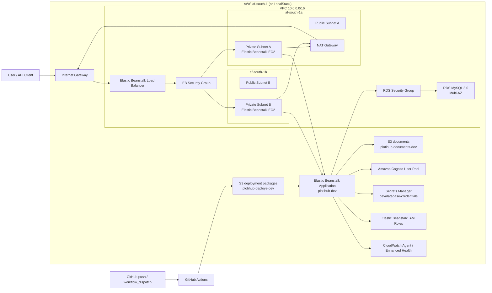
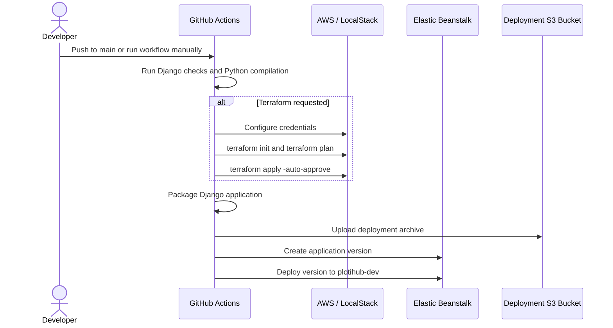

# Plotihub Infrastructure Flow

## Implemented topology

```mermaid
flowchart LR
    USER["User / API Client"]
    GH["GitHub Actions"]
    CF["GitHub push / workflow_dispatch"]

    subgraph AWS["AWS af-south-1 (or LocalStack)"]
        IGW["Internet Gateway"]

        subgraph VPC["VPC 10.0.0.0/16"]
            subgraph AZA["af-south-1a"]
                PUB_A["Public Subnet A"]
                PRIV_A["Private Subnet A<br/>Elastic Beanstalk EC2"]
                NAT_NODE["NAT Gateway"]
            end

            subgraph AZB["af-south-1b"]
                PUB_B["Public Subnet B"]
                PRIV_B["Private Subnet B<br/>Elastic Beanstalk EC2"]
            end

            ALB["Elastic Beanstalk Load Balancer"]
            RDS["RDS MySQL 8.0<br/>Multi-AZ"]
            SG_EB["EB Security Group"]
            SG_RDS["RDS Security Group"]
        end

        EB["Elastic Beanstalk Application<br/>plotihub-dev"]
        S3_DOC["S3 documents<br/>plotihub-documents-dev"]
        S3_DEPLOY["S3 deployment packages<br/>plotihub-deploys-dev"]
        COGNITO["Amazon Cognito User Pool"]
        SECRETS["Secrets Manager<br/>dev/database-credentials"]
        IAM["Elastic Beanstalk IAM Roles"]
        CW["CloudWatch Agent / Enhanced Health"]
    end

    USER --> IGW
    IGW --> ALB
    ALB --> SG_EB
    SG_EB --> PRIV_A
    SG_EB --> PRIV_B
    PRIV_A --> EB
    PRIV_B --> EB
    EB --> SG_RDS
    SG_RDS --> RDS
    EB --> S3_DOC
    GH --> S3_DEPLOY
    S3_DEPLOY --> EB
    CF --> GH
    EB --> COGNITO
    EB --> SECRETS
    EB --> IAM
    EB --> CW
    PRIV_A --> NAT_NODE
    PRIV_B --> NAT_NODE
    NAT_NODE --> IGW
```

## Deployment flow

```mermaid
sequenceDiagram
    actor Developer
    participant GitHub as GitHub Actions
    participant AWS as AWS / LocalStack
    participant EB as Elastic Beanstalk
    participant S3 as Deployment S3 Bucket

    Developer->>GitHub: Push to main or run workflow manually
    GitHub->>GitHub: Run Django checks and Python compilation
    alt Terraform requested
        GitHub->>AWS: Configure credentials
        GitHub->>AWS: terraform init and terraform plan
        GitHub->>AWS: terraform apply -auto-approve
    end
    GitHub->>GitHub: Package Django application
    GitHub->>S3: Upload deployment archive
    GitHub->>EB: Create application version
    GitHub->>EB: Deploy version to plotihub-dev
```
